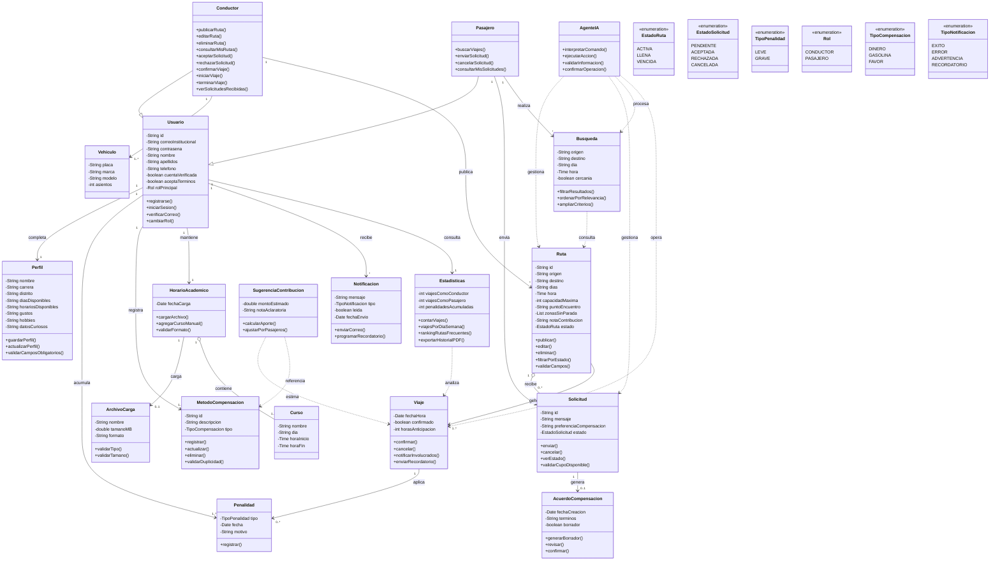
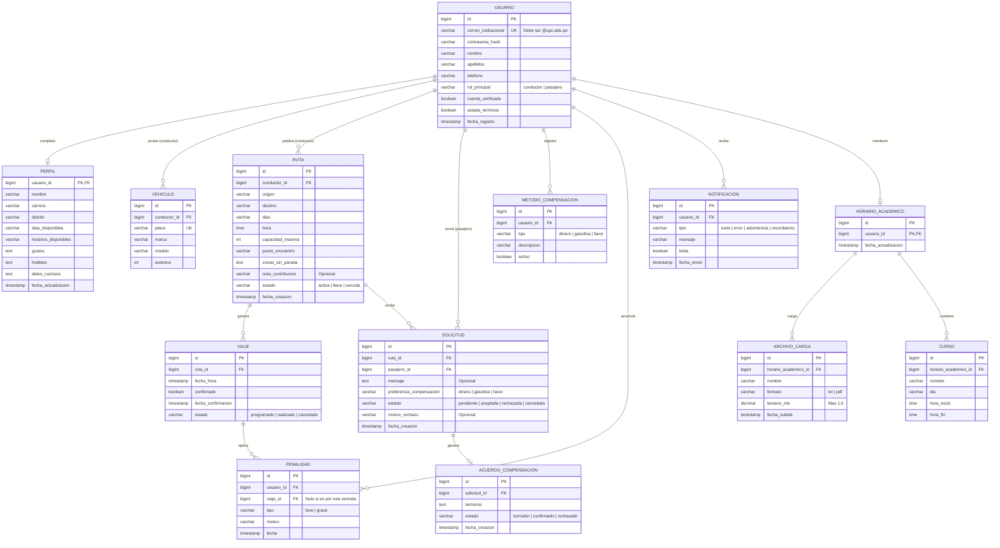

# Diagramas

Aquí se encuentran todos los diagramas relacionados al proyecto.

## Diagrama de Clases

```mermaid
classDiagram
  class Usuario {
    -String id
    -String correoInstitucional
    -String contrasena
    -String nombre
    -String apellidos
    -String telefono
    -boolean cuentaVerificada
    -boolean aceptaTerminos
    -Rol rolPrincipal
    +registrarse()
    +iniciarSesion()
    +verificarCorreo()
    +cambiarRol()
  }

  class Conductor {
    +publicarRuta()
    +editarRuta()
    +eliminarRuta()
    +consultarMisRutas()
    +aceptarSolicitud()
    +rechazarSolicitud()
    +confirmarViaje()
    +iniciarViaje()
    +terminarViaje()
    +verSolicitudesRecibidas()
  }

  class Pasajero {
    +buscarViajes()
    +enviarSolicitud()
    +cancelarSolicitud()
    +consultarMisSolicitudes()
  }

  class Perfil {
    -String nombre
    -String carrera
    -String distrito
    -String diasDisponibles
    -String horariosDisponibles
    -String gustos
    -String hobbies
    -String datosCuriosos
    +guardarPerfil()
    +actualizarPerfil()
    +validarCamposObligatorios()
  }

  class Vehiculo {
    -String placa
    -String marca
    -String modelo
    -int asientos
  }

  class Ruta {
    -String id
    -String origen
    -String destino
    -String dias
    -Time hora
    -int capacidadMaxima
    -String puntoEncuentro
    -List zonasSinParada
    -String notaContribucion
    -EstadoRuta estado
    +publicar()
    +editar()
    +eliminar()
    +filtrarPorEstado()
    +validarCampos()
  }

  class Solicitud {
    -String id
    -String mensaje
    -String preferenciaCompensacion
    -EstadoSolicitud estado
    +enviar()
    +cancelar()
    +verEstado()
    +validarCupoDisponible()
  }

  class AcuerdoCompensacion {
    -Date fechaCreacion
    -String terminos
    -boolean borrador
    +generarBorrador()
    +revisar()
    +confirmar()
  }

  class Viaje {
    -Date fechaHora
    -boolean confirmado
    -int horasAnticipacion
    +confirmar()
    +cancelar()
    +notificarInvolucrados()
    +enviarRecordatorio()
  }

  class Penalidad {
    -TipoPenalidad tipo
    -Date fecha
    -String motivo
    +registrar()
  }

  class MetodoCompensacion {
    -String id
    -String descripcion
    -TipoCompensacion tipo
    +registrar()
    +actualizar()
    +eliminar()
    +validarDuplicidad()
  }

  class HorarioAcademico {
    -Date fechaCarga
    +cargarArchivo()
    +agregarCursoManual()
    +validarFormato()
  }

  class ArchivoCarga {
    -String nombre
    -double tamanoMB
    -String formato
    +validarTipo()
    +validarTamano()
  }

  class Curso {
    -String nombre
    -String dia
    -Time horaInicio
    -Time horaFin
  }

  class Notificacion {
    -String mensaje
    -TipoNotificacion tipo
    -boolean leida
    -Date fechaEnvio
    +enviarCorreo()
    +programarRecordatorio()
  }

  class Busqueda {
    -String origen
    -String destino
    -String dia
    -Time hora
    -boolean cercania
    +filtrarResultados()
    +ordenarPorRelevancia()
    +ampliarCriterios()
  }

  class SugerenciaContribucion {
    -double montoEstimado
    -String notaAclaratoria
    +calcularAporte()
    +ajustarPorPasajeros()
  }

  class Estadisticas {
    -int viajesComoConductor
    -int viajesComoPasajero
    -int penalidadesAcumuladas
    +contarViajes()
    +viajesPorDiaSemana()
    +rankingRutasFrecuentes()
    +exportarHistorialPDF()
  }

  class AgenteIA {
    +interpretarComando()
    +ejecutarAccion()
    +validarInformacion()
    +confirmarOperacion()
  }

  class EstadoRuta {
    <<enumeration>>
    ACTIVA
    LLENA
    VENCIDA
  }

  class EstadoSolicitud {
    <<enumeration>>
    PENDIENTE
    ACEPTADA
    RECHAZADA
    CANCELADA
  }

  class TipoPenalidad {
    <<enumeration>>
    LEVE
    GRAVE
  }

  class Rol {
    <<enumeration>>
    CONDUCTOR
    PASAJERO
  }

  class TipoCompensacion {
    <<enumeration>>
    DINERO
    GASOLINA
    FAVOR
  }

  class TipoNotificacion {
    <<enumeration>>
    EXITO
    ERROR
    ADVERTENCIA
    RECORDATORIO
  }

  Conductor --|> Usuario
  Pasajero --|> Usuario
  Usuario "1" --> "1" Perfil : completa
  Conductor "1" --> "1..*" Vehiculo : posee
  Conductor "1" --> "*" Ruta : publica
  Pasajero "1" --> "*" Solicitud : envia
  Ruta "1" o-- "0..*" Solicitud : recibe
  Solicitud "1" --> "0..1" AcuerdoCompensacion : genera
  Ruta "1" --> "1..*" Viaje : genera
  Viaje "1" --> "0..*" Penalidad : aplica
  Usuario "1" --> "1..*" Penalidad : acumula
  Usuario "1" --> "1..*" MetodoCompensacion : registra
  Usuario "1" --> "1" HorarioAcademico : mantiene
  HorarioAcademico "1" --> "0..1" ArchivoCarga : carga
  HorarioAcademico "1" o-- "1..*" Curso : contiene
  Usuario "1" --> "*" Notificacion : recibe
  Pasajero "1" --> "*" Busqueda : realiza
  Busqueda ..> Ruta : consulta
  SugerenciaContribucion ..> Viaje : estima
  SugerenciaContribucion ..> MetodoCompensacion : referencia
  Usuario "1" --> "1" Estadisticas : consulta
  Estadisticas ..> Viaje : analiza
  AgenteIA ..> Ruta : gestiona
  AgenteIA ..> Solicitud : gestiona
  AgenteIA ..> Busqueda : procesa
  AgenteIA ..> Viaje : opera
```

## Diagrama de Diseño de la Base de Datos

```mermaid
erDiagram
  USUARIO ||--o| PERFIL : "completa"
  USUARIO ||--o{ VEHICULO : "posee (conductor)"
  USUARIO ||--o{ RUTA : "publica (conductor)"
  USUARIO ||--o{ SOLICITUD : "envia (pasajero)"
  USUARIO ||--o{ METODO_COMPENSACION : "registra"
  USUARIO ||--o{ PENALIDAD : "acumula"
  USUARIO ||--o{ NOTIFICACION : "recibe"
  USUARIO ||--o| HORARIO_ACADEMICO : "mantiene"
  RUTA ||--o{ VIAJE : "genera"
  RUTA ||--o{ SOLICITUD : "recibe"
  SOLICITUD ||--o| ACUERDO_COMPENSACION : "genera"
  VIAJE ||--o{ PENALIDAD : "aplica"
  HORARIO_ACADEMICO ||--o{ ARCHIVO_CARGA : "carga"
  HORARIO_ACADEMICO ||--o{ CURSO : "contiene"

  USUARIO {
    bigint id PK
    varchar correo_institucional UK "Debe ser @upc.edu.pe"
    varchar contrasena_hash
    varchar nombre
    varchar apellidos
    varchar telefono
    varchar rol_principal "conductor | pasajero"
    boolean cuenta_verificada
    boolean acepta_terminos
    timestamp fecha_registro
  }
  PERFIL {
    bigint usuario_id PK, FK
    varchar nombre
    varchar carrera
    varchar distrito
    varchar dias_disponibles
    varchar horarios_disponibles
    text gustos
    text hobbies
    text datos_curiosos
    timestamp fecha_actualizacion
  }
  VEHICULO {
    bigint id PK
    bigint conductor_id FK
    varchar placa UK
    varchar marca
    varchar modelo
    int asientos
  }
  RUTA {
    bigint id PK
    bigint conductor_id FK
    varchar origen
    varchar destino
    varchar dias
    time hora
    int capacidad_maxima
    varchar punto_encuentro
    text zonas_sin_parada
    varchar nota_contribucion "Opcional"
    varchar estado "activa | llena | vencida"
    timestamp fecha_creacion
  }
  VIAJE {
    bigint id PK
    bigint ruta_id FK
    timestamp fecha_hora
    boolean confirmado
    timestamp fecha_confirmacion
    varchar estado "programado | realizado | cancelado"
  }
  SOLICITUD {
    bigint id PK
    bigint ruta_id FK
    bigint pasajero_id FK
    text mensaje "Opcional"
    varchar preferencia_compensacion "dinero | gasolina | favor"
    varchar estado "pendiente | aceptada | rechazada | cancelada"
    varchar motivo_rechazo "Opcional"
    timestamp fecha_creacion
  }
  ACUERDO_COMPENSACION {
    bigint id PK
    bigint solicitud_id FK
    text terminos
    varchar estado "borrador | confirmado | rechazado"
    timestamp fecha_creacion
  }
  METODO_COMPENSACION {
    bigint id PK
    bigint usuario_id FK
    varchar tipo "dinero | gasolina | favor"
    varchar descripcion
    boolean activo
  }
  PENALIDAD {
    bigint id PK
    bigint usuario_id FK
    bigint viaje_id FK "Nulo si es por ruta vencida"
    varchar tipo "leve | grave"
    varchar motivo
    timestamp fecha
  }
  NOTIFICACION {
    bigint id PK
    bigint usuario_id FK
    varchar tipo "exito | error | advertencia | recordatorio"
    varchar mensaje
    boolean leida
    timestamp fecha_envio
  }
  HORARIO_ACADEMICO {
    bigint id PK
    bigint usuario_id PK, FK
    timestamp fecha_actualizacion
  }
  ARCHIVO_CARGA {
    bigint id PK
    bigint horario_academico_id FK
    varchar nombre
    varchar formato "txt | pdf"
    decimal tamano_mb "Max 1.0"
    timestamp fecha_subida
  }
  CURSO {
    bigint id PK
    bigint horario_academico_id FK
    varchar nombre
    varchar dia
    time hora_inicio
    time hora_fin
  }
```
